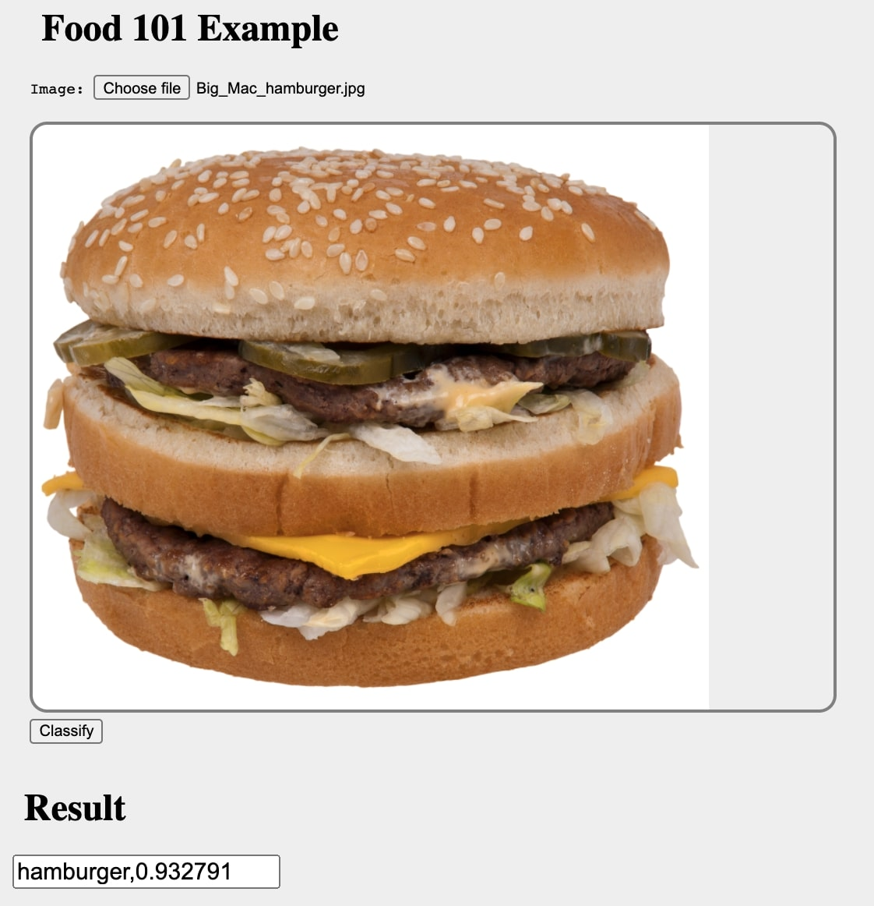

# Hosting food101 deep learning model

The model (food101-tensorflow-serving/tensorflow-serving/classifier/) is produced by retraining all layers of InceptionV3 (initialised with imagenet weights) with the food101 dataset
(https://www.kaggle.com/dansbecker/food-101/home) Top-1 accuracy is ~83%

## How to build and run using docker

```
docker-compose up --build
```

Go to your browswer: http://localhost:5000 and upload the photo

Output = (class, score)

 
